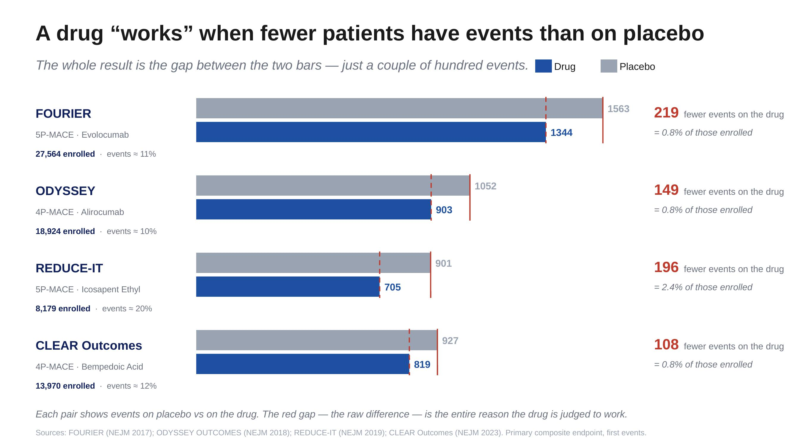
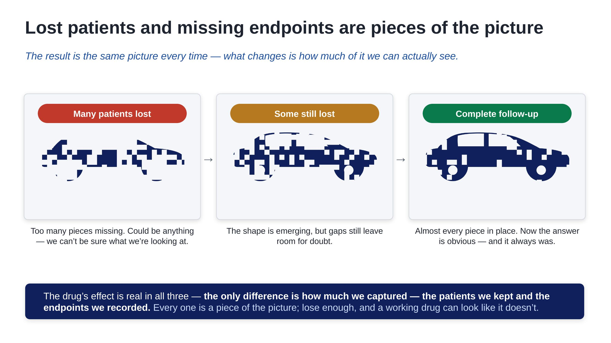

# The Room Where the Experiment Lives

*By Andrea Grioni*

---

Some of the most important work in clinical development doesn't happen in a system. It happens in a room.

Last week I spent two days in exactly that kind of room, in Paris — national leaders and Novartis country teams from across Europe, gathered to talk through how the trial is really going. Not a deck circulated by email and skimmed on a phone. Chairs, whiteboards, coffee going cold, and a roomful of people who run a trial in their respective countries arguing, in the good sense, about what is working and what isn't.

I left with something I couldn't have built over email: real relationships with the country teams. Those connections are what carry a trial — through the hard stretches of running it, and through the work of closing it well.

I want to write about that — the human side of clinical development. The part that never shows up in a protocol.

## What a trial actually is

It helps to strip the thing back to what it really is. Underneath the acronyms, the systems, the visit schedules and the trackers, a clinical trial is a controlled scientific experiment. It asks one question, and only one: does the drug work better than the standard of care?

Everything else — every process, every form, every phone call to a patient — exists to protect the integrity of that single question. That's worth holding onto, because it's easy to lose in the day-to-day. When you're chasing a missing data point or reconciling a query, it can feel like administration. It isn't. It's the experiment.

## How thin the answer really is

Here is the part that still stops me when I look at it.

These are four of the landmark cardiovascular outcome trials of recent years — trials that enrolled anywhere from roughly eight thousand to nearly thirty thousand patients. Enormous, expensive, definitive studies. The kind that decide whether a medicine reaches the people who need it.

And look at how the answer is actually decided.

Each trial shows two bars: the number of cardiovascular events on the drug, and the number on placebo. A drug 'works' only when its bar is shorter — fewer events than the control group. And the gap between those two bars — the entire reason a drug is judged a success or a failure — comes down to a couple of hundred events. Around two hundred, in a trial of tens of thousands. As the chart shows, that deciding margin is often less than one percent of everyone enrolled.

Let that sit for a second. Thirty thousand people, years of work, and the verdict turns on roughly two hundred events landing one way rather than the other.

That is the experiment. That is how fine the line is between "this medicine works" and "it doesn't."

## Why every patient is part of the answer

If the whole result rests on so few events, then the experiment is fragile — and fragile in a very specific way. The signal it's trying to detect is faint. And a faint signal is easily lost.

This is the part I find most useful to make visible, because it's hard to feel in the abstract.

*(A small confession: this comparison is borrowed from my old life training models to recognize images.)*

It's the same picture in all three. On the left, too many pieces are missing — you can't tell what you're looking at. It could be anything. In the middle, some pieces come back, and a shape starts to emerge — you can begin to guess. And on the right, with the full picture, there's no argument left.

It's a car. It always was a car.

The only thing that changed was how many pieces we had.

That is exactly what happens to a trial result. The answer is always there — the drug either works or it doesn't, in reality, regardless of what we manage to record. But whether we can *see* that answer depends entirely on how complete our picture is. Keep the patients, capture the events, and the picture is sharp enough to read. Lose too many, and it blurs — not because the truth changed, but because we stopped being able to see it.

When the entire result rests on two hundred events, every patient who slips out of follow-up isn't a missing row in a tracker. It's a missing piece of the picture.

## Back to the room

Those two days gave me something concrete: the country teams stopped being names on a distribution list and became people I now know — and that's the relationship I'll lean on when a site is struggling, or when we're working to bring the trial to a clean close.

Which is why two days in a room matters.

Most of clinical development is mediated — by systems, by dashboards, by status reports. A meeting like this collapses that distance. For two days, the work stops being data and becomes people again. You hear country leads describe what actually happens at their sites. You hear physicians tell stories about the patient who stopped answering the phone, and the coordinator who tracked someone down anyway. You hear the texture that no status report ever carries.

And that's where the real value is. Not in alignment slides, but in the unscripted moment when a genuine problem surfaces — because someone in the room felt safe enough to say "this isn't working for us," and the rest of the room leaned in to help solve it. You identify pitfalls. You weigh what to do next. You answer the questions people were carrying but hadn't asked. You leave not just aligned, but convinced — together — of why the small, stubborn work of keeping every patient in the study actually matters.

That conviction is hard to manufacture over email. It's almost easy in a room.

## The science it serves

For the trial behind all of this, the design was just published. The VICTORION-2 PREVENT design paper was published online in the *American Heart Journal* in May 2026 — a Phase 3, randomized, double-blind, placebo-controlled, international study testing whether inclisiran reduces major adverse cardiovascular events in patients with established atherosclerotic disease who are already on high-intensity statins. The primary endpoint is three-point MACE: cardiovascular death, non-fatal heart attack, non-fatal stroke. The treatment is given as an injection on day one, at month three, and every six months after that.

That last detail is quietly the whole challenge. Every six months. In the long stretches between those visits, life happens — people move, people change doctors, people drift. The paper is the skeleton of the experiment. The room, and the relationships in it, are the muscle that keeps it standing.

I [wrote previously](story.html?file=docs/AG014_clinical_development.md) about why outcome trials are "a different animal" — why a missing patient isn't a missing data point but a missing story. The room is what that idea looks like in practice.

## The part that doesn't show up in a protocol

We tend to picture clinical research as something cold and procedural. Numbers, systems, compliance. But spend two days in that room and you see what it actually runs on: relationships. Between sponsor and site. Between investigator and patient. Between the people who carry a trial in each country and have to believe, personally, that the next phone call is worth making.

A trial is an experiment. But it's an experiment made of people — and the answer it produces is only as clear as the picture they manage to keep.

---

> "You can't schedule a clinical event. You can only earn the trust that keeps someone answering the phone."

---

*Author's Note: The views expressed here are my own and do not represent the position of Novartis or any of its affiliates.*

*For further details or to get in touch, visit my [personal page](https://andreagrioni.github.io/) or connect on [LinkedIn](https://www.linkedin.com/in/agrioni/).*